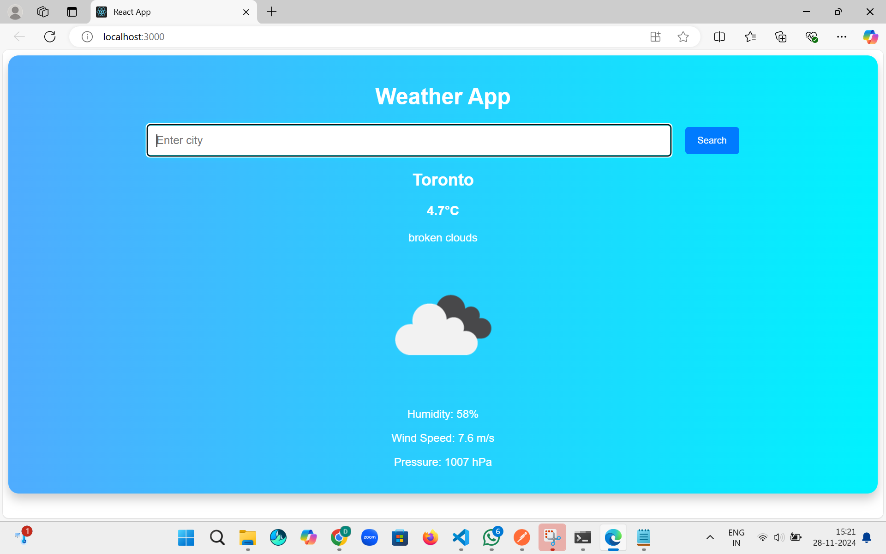
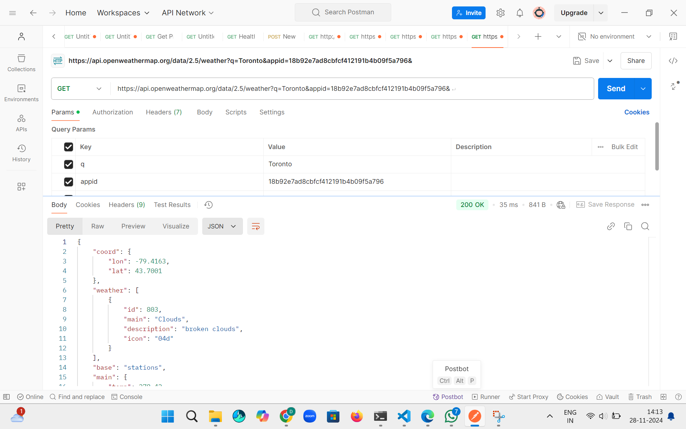

Weather App

This is a ReactJS-based weather application that fetches and displays real-time weather data from the OpenWeatherMap API. Users can search for any city to view current weather details, including temperature, weather conditions, and forecast for the next few days.

Features

	•	Displays current weather data for any city.
	•	Dynamic city search functionality.
	•	Weather icons for better visualization.
	•	Five-day weather forecast display.
	•	Modern UI/UX design with clean and responsive interface.

Technologies Used

	•	ReactJS for frontend.
	•	OpenWeatherMap API for weather data.
	•	CSS for styling.
	•	Axios for API requests.

Installation Instructions

	1.	Clone the repository:

git clone https://github.com/Vijay1259/101414516_comp3123_labtest2

	2.	Navigate to the project directory:

cd 101414516_comp3123_labtest2

	3.	Install dependencies:

npm install

	4.	Start the application:

npm start

	5.	Open your browser and navigate to http://localhost:3000.

Screenshots

Current Weather Display

Five-Day Weather Forecast

Postman API Response

Weather Forecast Horizontal Layout

Weather Forecast Details

How It Works

	1.	User Search: Enter a city name in the input field and press “Get Weather.”
	2.	API Integration: The app fetches data from OpenWeatherMap API using Axios.
	3.	Dynamic UI: The app dynamically updates the display with the city’s current weather and a five-day forecast.
	4.	Error Handling: Displays a user-friendly message for invalid city searches.

Postman API Testing

Postman was used to test the weather API endpoints to ensure proper integration and response. Below is the test result:

Future Enhancements

	•	Add hourly forecast data.
	•	Include additional weather details like UV index, sunrise/sunset times.
	•	Improve accessibility for a wider range of users.

REACT_APP_WEATHER_API_KEY=18b92e7ad8cbfcf412191b4b09f5a796

Author

	•	Name:Diya  VijayKumar  Patel
	•	Student ID: 101414516

1. Postman Response

 2. Application Home Page

 3. Search Results

 4. Weather Data Display

 5. Forecast Display

6. API Data Handling

